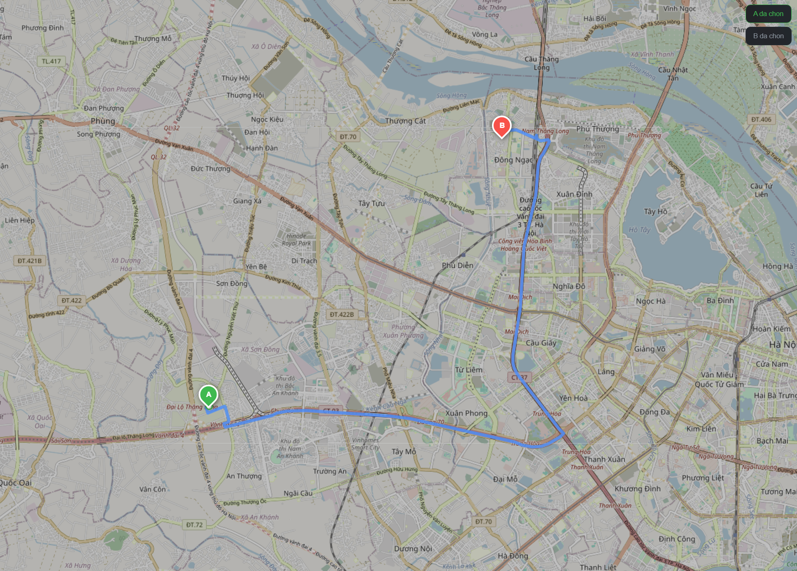
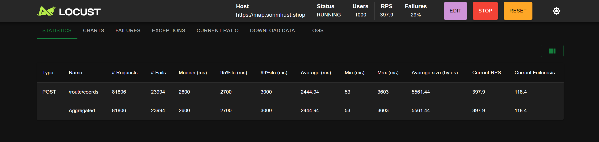

# SoosleMap Routing Engine

A high-performance, in-memory routing engine and spatial geocoding service written in C++ and exposed via FastAPI (Python). It computes shortest paths over real-world road networks (e.g., 1.85M nodes, 7.4M edges) in under a millisecond using Contraction Hierarchies (CH).



## Key Performance Highlights

- Sub-millisecond Latency: Achieves ~0.1ms warm query latency using Bidirectional Dijkstra on the CH graph.
- High Concurrency (Zero Downtime): Sustained a stress load of >400 RPS (~24,400 req/min) on a memory-constrained 1GB ARM64 VM (AWS EC2 t4g.small) with a deterministic queue median of 1.2s (verified via Little's Law).
- True Multi-threading: Zero-overhead Python bindings via Pybind11, releasing the Python Global Interpreter Lock (GIL) during C++ execution to unlock parallel request processing in Uvicorn.
- Cache-optimized Data Structures: 
  - Flattened STR-Tree spatial index with a Structure-of-Arrays (SoA) hot/cold layout, increasing cache-line density from 2.3 to 5.3 nodes.
  - A 64-entry LRU cache mapping quantized GPS coordinates, cutting repeated edge-snapping time from 2.2ms to 6μs (370x speedup).
- Constant Memory Footprint: Utilizes a pre-allocated 30MB query workspace with $O(|V_{visited}|)$ selective state resets, eliminating malloc/new overhead during routing queries.

---

## System Architecture

The project is containerized using a multi-tier architecture to maximize throughput and minimize latency:

1. Cloudflare CDN / Nginx (Network Layer): Handles static assets, provides flexible SSL, and caches identical `/route/coords` queries directly from the edge network (< 1ms).
2. FastAPI & Uvicorn (Application Layer): Manages concurrent HTTP requests and routes them to the C++ core or Redis.
3. Redis (Cache Layer): Caches SQLite Geocoding resolution (POI names to coordinates) with a 24h TTL, bypassing disk I/O (~2-5ms).
4. C++ Core (Engine Layer): Computes the mathematical shortest path directly in RAM with zero inter-process communication overhead.

### Load Test Benchmark (Locust)

Under a 500 concurrent users stress test, the system maintained a flawless failure-free serving rate of 407 RPS on a 2-vCPU ARM instance.



---

## Build & Setup Guide

### 1. Prerequisites
- C++ Compiler: MSVC (Windows) or GCC/Clang (Linux/macOS)
- CMake (>= 3.10)
- Python (>= 3.10)
- Docker & Docker Compose (for deployment)

### 2. Local Build (C++ & Python Bindings)

```bash
# Initialize build directory
cmake -B build

# Compile C++ executable and Pybind11 module
cmake --build build --config Release
```

### 3. Data Preprocessing

1. Download an `.osm.pbf` map file (e.g., `hanoi.osm.pbf`) from Geofabrik.
2. Place it in the root directory and run the parser:

```bash
./build/Release/RoutingEngine_Parser.exe hanoi.osm.pbf
```
*(This extracts OSM data, builds the SQLite FTS5 geocoding database, computes the Contraction Hierarchies graph, and serializes the STR-Tree to binary files).*

### 4. Running the API (Docker Compose)

The production environment is fully containerized. Data files are mounted via volumes.

```bash
# Start Nginx, FastAPI, and Redis
docker-compose up --build -d
```
API will be available at `http://localhost:8000` (FastAPI) and `http://localhost:80` (Nginx).

---

## Repository Structure

- `src/preprocessing/`: C++ code for OSM parsing, graph contraction, and STR-Tree building.
- `src/query/`: C++ routing algorithms (Bidirectional Dijkstra) and workspace logic.
- `src/python/`: Pybind11 wrapper exposing C++ classes to Python.
- `app/`: FastAPI application, Nginx configurations, and frontend HTML/JS.
- `OptimizationTechnique.md`: Detailed documentation on low-level C++ optimizations and deployment architecture.
- `.github/workflows/`: CI/CD pipelines for automated ARM64 cross-compilation via `docker/buildx`.
